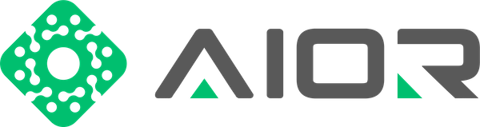
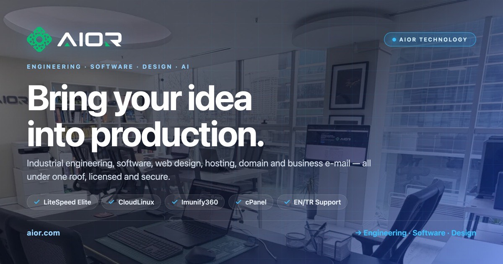

<picture>
  <source media="(prefers-color-scheme: dark)" srcset="assets/aior-logo-dark.png">
  
</picture>

### Engineering · Software · Design · Artificial Intelligence
#### Mühendislik · Yazılım · Tasarım · Yapay Zeka

---

## 🇬🇧 About AIOR Technology

**AIOR Teknoloji Limited Şirketi** is an end-to-end technology partner delivering
**software engineering, artificial intelligence, web hosting, domains, cybersecurity
and digital transformation** across 20 service categories. Field-tested engineering
since 2009, first web project in 2001, incorporated in 2025 — serving clients in
Türkiye and worldwide.

> First web **2001** · Engineering since **2009** · Incorporated **2025** · 16+ years of experience

## 🇹🇷 AIOR Teknoloji Hakkında

**AIOR Teknoloji Limited Şirketi**; **yazılım mühendisliği, yapay zeka, web hosting,
alan adı, siber güvenlik ve dijital dönüşüm** alanlarında 20 kategoride uçtan uca
çözüm sunan bir teknoloji ortağıdır. 2009'dan bu yana saha tecrübesi, 2001'de ilk
web projesi, 2025'te resmi tüzel kişilik — Türkiye ve dünya genelinde hizmet.

---

## 🚀 Services · Hizmetler

Explore all 20 categories — full bilingual SEO pages:
Tüm 20 kategori — çift dilli SEO sayfaları:

| Kategori / Category | EN | TR |
|---|---|---|
| All Services / Tüm Hizmetler | [services](https://aior.com/services) | [hizmetlerimiz](https://aior.com/hizmetlerimiz) |

<table>
<tr>
<td valign="top">

**Software & AI**
- [Software Engineering](https://aior.com/services#cat-software-engineering)
- [Mobile Platforms](https://aior.com/services#cat-mobile-platforms)
- [Artificial Intelligence & Data](https://aior.com/services#cat-artificial-intelligence-and-data)
- [Computer Vision](https://aior.com/services#cat-computer-vision)
- [3D Engineering](https://aior.com/services#cat-3d-engineering)
- [Robotics & Mechatronics](https://aior.com/services#cat-robotics-mechatronics)
- [IoT & Smart Systems](https://aior.com/services#cat-iot-smart-systems)

</td>
<td valign="top">

**Hosting & Infra**
- [Hosting & Servers](https://aior.com/services#cat-hosting-servers)
- [Domain & DNS](https://aior.com/services#cat-domain-dns)
- [Network Infrastructure](https://aior.com/services#cat-network-infrastructure)
- [Cyber Security](https://aior.com/services#cat-cyber-security)
- [WHMCS Automation](https://aior.com/services#cat-whmcs-automation)
- [Camera & Security](https://aior.com/services#cat-camera-security)

</td>
<td valign="top">

**Industry & Growth**
- [Industrial Automation](https://aior.com/services#cat-industrial-automation)
- [Manufacturing Quality](https://aior.com/services#cat-manufacturing-quality)
- [E-Commerce](https://aior.com/services#cat-e-commerce)
- [Marketing & SEO](https://aior.com/services#cat-marketing-seo)
- [Design & Branding](https://aior.com/services#cat-design-branding)
- [Forum & Communities](https://aior.com/services#cat-forum-communities)
- [Corporate Digital Transformation](https://aior.com/services#cat-corporate-digital-transformation)

</td>
</tr>
</table>

---

## 🏗️ Infrastructure · Altyapı

- **3 Gbps** dedicated port · Germany & France datacenters (Frankfurt · Paris)
- **CloudLinux + LiteSpeed Web Host Elite + Imunify360** for every user
- Redundant **VPS · Dedicated · DNS · Backup** servers
- AutoSSL, DDoS protection, daily backups

---

## 🤝 Partners · Partnerler

Signed partnership agreements with direct API integration:
Doğrudan API entegrasyonlu, imzalı partnerlik anlaşmaları:

`WHMCS` · `cPanel` · `Plesk` · `DirectAdmin` · `LiteSpeed` · `CloudLinux` ·
`Imunify360` · `Windows Server` · `Cloudflare` · `OVHcloud` · `Microsoft 365` ·
`Google Workspace` · `CentralNic` · `Ticimax` · `Enom` · `METUnic` · `NetGSM` ·
`Mükellef.co` · `iyzico`

➡️ [aior.com/partners](https://aior.com/partners)

---

## 📂 Work · Çalışmalarımız

- 🧩 **Projects / Projeler** — [aior.com/projects](https://aior.com/projects) · [aior.com/projeler](https://aior.com/projeler)
- ⭐ **References / Referanslar** — [aior.com/references](https://aior.com/references) · [aior.com/referanslar](https://aior.com/referanslar)
- 🛒 **Market / Mağaza** — [aior.com/market](https://aior.com/market) · [aior.com/magaza](https://aior.com/magaza)
- 📰 **Blog** — [aior.com/blog](https://aior.com/blog)
- 👥 **Community / Forum** — [aior.com/community](https://aior.com/community)

> 🔒 Our production source code (WHMCS, XenForo, Astro, deploy automation) is kept in
> **private** repositories. This profile and aior.com showcase our public work only.
>
> Üretim kaynak kodumuz **private** depolarda tutulur; bu profil ve aior.com yalnızca
> herkese açık çalışmalarımızı sergiler.

---

## 📞 Contact · İletişim

| | |
|---|---|
| 🌐 Website | [aior.com](https://aior.com) |
| ✉️ E-mail | [hi@aior.com](mailto:hi@aior.com) |
| 📨 KEP | aior@hs01.kep.tr |
| ☎️ Phone | [+90 850 309 80 80](tel:+908503098080) |
| 💬 WhatsApp | [+90 532 349 00 20](https://wa.me/905323490020) |
| 📍 Address | Geçit Mah. 6. Gümüş Sk. No: 6, Balkar Plaza A Blok K:1 D:2, Osmangazi / Bursa / Türkiye |
| 🕐 Hours | Mon–Sat · 08:00–20:00 (Phone & WhatsApp reachable 24/7) |

### Connect · Bağlan

 

**© AIOR Teknoloji Limited Şirketi** — Field-tested engineering · 2009 → today

